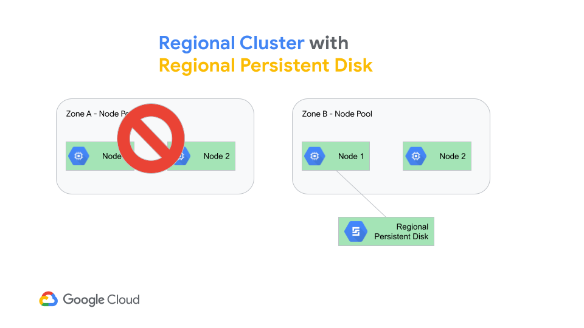

# Toil-free High Availability for Stateful GKE Workloads
We will explore the HA and resiliency that GKE offers for stateful workloads. 
We will demonstrate how stateful containerized application deployed on GKE can recover from failure of an entire Zone without any operational overheads.
This shows the extreme resiliency natively offered by GKE and GCP. 

We will use 2-tier wordpress application. This application has 2 persistent deployments - 
1. MySQL as a relational store
2. Wordpress app itself that uses the MySQL as well has its own persistent store 

Following is the app architecture that we will deploy on the GKE cluster. 


We have used [Kustomize](https://kustomize.io/) to render the final YAML and create a MySQL password dynamically. 

For purpose of this demo is to show how GKE provides autohealing and HA for presistent workloads even in case of a zonal failure.
We will create a [regional GKE cluster] with 2 node pools. Each node pool will be assigned to a particular zone. E.g. Zone A node pool will create nodes only in Zone A, and Zone B node pool will create nodes only in Zone B. 

First, we will deploy the application (2 separate deployments) on Zone A. :neutral_face:


Then we will demonstrate a very unlikely event of a zonal failure by literally deleting the node pool (now you know why we created the node pool for a single/particular zone). :worried:


And we will watch how GKE recovers the entire Wordpress application (2 stateful apps) on the other zone/node pool. :star_struck:


Let us start the demo now! 

## Step 1 - setup GKE cluster
Create a **regional** GKE cluster with two node pools
- us-central1-a: Specify zone **us-central1-a**
- us-central1-b: Specify zone **us-central1-b**

Use ```e2-highcpu-8``` with only 1 node each. 
Creating node pools with these names will help you identify the actual node pool easily for a given node. 
Cluster should look like shown below.


## Step 2 - create storage class
We will use [Compute Engine persistent disk CSI Driver](https://cloud.google.com/kubernetes-engine/docs/how-to/persistent-volumes/gce-pd-csi-driver) to create our storage class. 

**Note** - If you want to use storage size less than 200Gi then you need to ```pd-ssd``` persistent disk, otherwise you can use ```pd-standard```.

Use following YAML for the storage class definition.
```
kubectl apply -f regional-pd-sc.yaml
```

## Step 3 - Deploy Wordpress app on Zone A
```
kubectl apply -k ./
```

## Step 4 - Access the Wordperss app
```
kubectl get svc -w
```
Use the LB IP for wordpress service and access the Wordpress app. Setup your user and add a blog post.
In another window keep checking the status of the pods. 
```
kubectl get po -o wide -w
```
Or use K9s if you have the tool.
You can notice that the wordpress application pods are currently deployed on ```us-central1-a``` nodepool. That is because of the ```nodeAffinity``` in the deployments. 

Customize the wordpress site you got, setup a user, change the background image, add a post, etc. Basically make some changes that will be persisted. After recovery we should be able to see the changes made to the site to ensure we had the HA working properly.


## Step 5 - Kill a node pool
To demonstrate failure of a zone just delete a Node Pool. Since our app is deployed on zone A we will delete that node pool. 
```
gcloud container node-pools delete us-central1-a --cluster=<Your-cluster-name>
```
Or you can delete the node pool ```us-central1-a``` from GCP console as well. 


Please note, you've to delete it from the **GKE cluster > Nodes** page. 

**_NO NOT_ directly delete the VM or VM group.**

## Step 6 - Verify _Auto-heal_ on Zone B
```
kubectl get po -o wide -w
```
As soon as the pod status shows running you can try accessing the Wordpress app again using the same LB IP as used earlier. 
Or you can use K9s to check the pods getting recreated almost instantaneously on other node pool. 


If the pods end up in the ```Running``` state means they managed to get hold of the PVC required to start the pod. 


Once the pods are in a running state try accessing the wordpress site using the same IP address as earlier and make sure you can see the change you made. 


